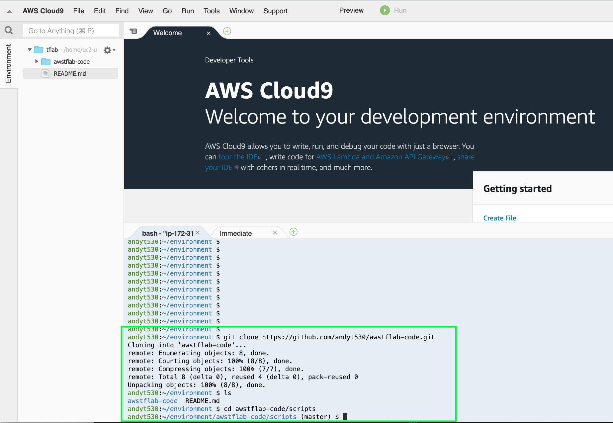

## Setup

### Download & run Helper scripts

In this section we will download a helper script that will install terraform into the Cloud9 IDE you have created


**:white_check_mark: Step-by-step Instructions**

1. Withon your Cloud9 IDE bash window run the following:


    ```console
    andyt530:~/environment $ git clone https://github.com/andyt530/awstflab-code.git
    Cloning into 'awstflab-code'...
    remote: Enumerating objects: 8, done.
    remote: Counting objects: 100% (8/8), done.
    remote: Compressing objects: 100% (7/7), done.
    remote: Total 8 (delta 0), reused 4 (delta 0), pack-reused 0
    Unpacking objects: 100% (8/8), done.
    andyt530:~/environment $ ls
    awstflab-code  README.md
    ```



### Next

:white_check_mark: Proceed to the first module, [Static Web Hosting][static-web-hosting], 
wherein you'll deploy a static web site via AWS Amplify Console.

[region-table]: https://aws.amazon.com/about-aws/global-infrastructure/regional-product-services/
[static-web-hosting]: ../1_StaticWebHosting/

