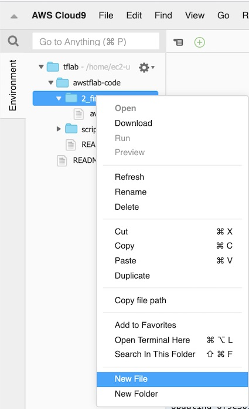
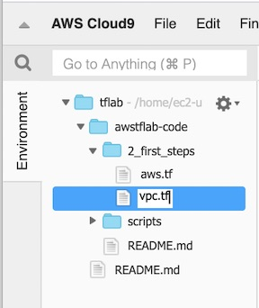
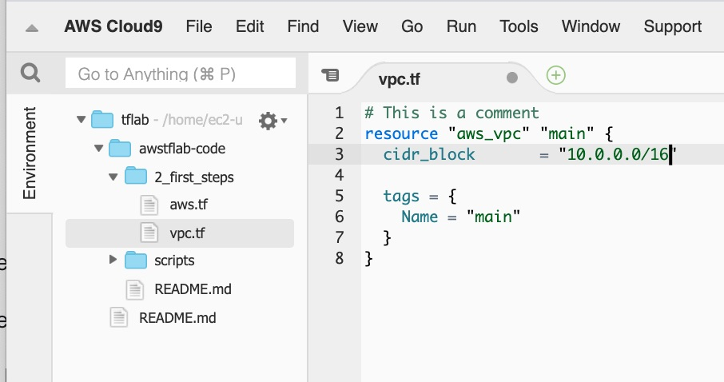
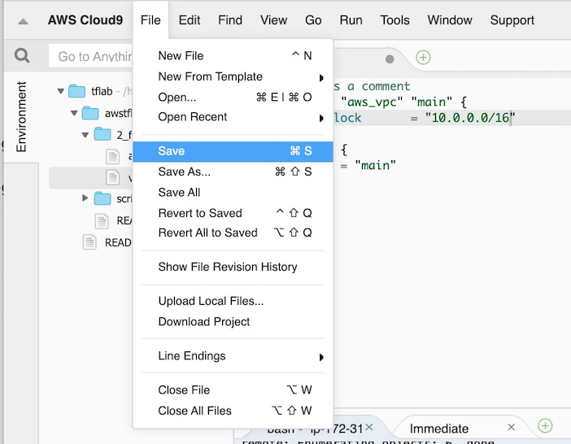

### Initialize the terraform resource provider

In this section we will initiaize terraform and build a basic VPC using terraform infrastructire as code
Terraform is used in several stages. y


we will step through these stages in our next activit

## The Init Stage

**:white_check_mark: Step-by-step Instructions**

1. Within your Cloud9 IDE bash window run the following :


    ```console
    andyt530:~/environment/awstflab-code/2_first_steps (master) $ terraform init   
    ```                                                                                        

    ```
    Initializing the backend...

    Initializing provider plugins...
    - Checking for available provider plugins...
    - Downloading plugin for provider "aws" (hashicorp/aws) 2.48.0...

    Terraform has been successfully initialized!

    You may now begin working with Terraform. Try running "terraform plan" to see
    any changes that are required for your infrastructure. All Terraform commands
    should now work.

    If you ever set or change modules or backend configuration for Terraform,
    rerun this command to reinitialize your working directory. If you forget, other
    commands will detect it and remind you to do so if necessary.
    andyt530:~/environment/awstflab-code/2_first_steps (master) $ 

    ```


## The Plan Stage

 2. Now create a new file called *vpc.tf* that contains terraform code to create a new VPC using the Cloud9 IDE






```
resource "aws_vpc" "vpc1" {
  cidr_block       = "10.0.0.0/16"

  tags = {
    Name = "main"
  }
}
```

### :star: Tips

:bulb: Look at the terraform documentation for examples of how to write infrastructure as code
https://www.terraform.io/docs/providers/aws/r/vpc.html


Next run the terraform plan command to get terraform to tell you what it intends to do and save the plan in an output file called "tfpaln"

```
terraform plan -out tfplan | more
```

```
Refreshing Terraform state in-memory prior to plan...                                                
The refreshed state will be used to calculate this plan, but will not be
persisted to local or remote state storage.                                                                                                               
------------------------------------------------------------------------                                                                                 
An execution plan has been generated and is shown below.                                                                                                  
Resource actions are indicated with the following symbols:                                              
  + create                                                                                                                                              
Terraform will perform the following actions:                                                                                                          
  # aws_vpc.main will be created                                                 

  + resource "aws_vpc" "main" {
      + arn                              = (known after apply)
      + assign_generated_ipv6_cidr_block = false
      + cidr_block                       = "10.0.0.0/16"
      + default_network_acl_id           = (known after apply)
      + default_route_table_id           = (known after apply)
      + default_security_group_id        = (known after apply)
      + dhcp_options_id                  = (known after apply)
      + enable_classiclink               = (known after apply)
      + enable_classiclink_dns_support   = (known after apply)
      + enable_dns_hostnames             = (known after apply)
      + enable_dns_support               = true
      + id                               = (known after apply)
      + instance_tenancy                 = "default"
      + ipv6_association_id              = (known after apply)
      + ipv6_cidr_block                  = (known after apply)
      + main_route_table_id              = (known after apply)
      + owner_id                         = (known after apply)
      + tags                             = {
          + "Name" = "main"
        }
    }

Plan: 1 to add, 0 to change, 0 to destroy.

------------------------------------------------------------------------

This plan was saved to: tfplan

To perform exactly these actions, run the following command to apply:
    terraform apply "tfplan"

andyt530:~/environment/awstflab-code/2_first_steps (master) $   

```


## The Apply Stage

3. If all looks OK - you can go ahead and deploy the planned changes by using the apply command:

```
terraform apply tfplan
```


Now check on the console and see if the VPC has been created:


## The Destroy Stage


### Next

:white_check_mark: Proceed to the first module, [Add additional resources](../3), 


[region-table]: https://aws.amazon.com/about-aws/global-infrastructure/regional-product-services/
[static-web-hosting]: ../1_StaticWebHosting/

